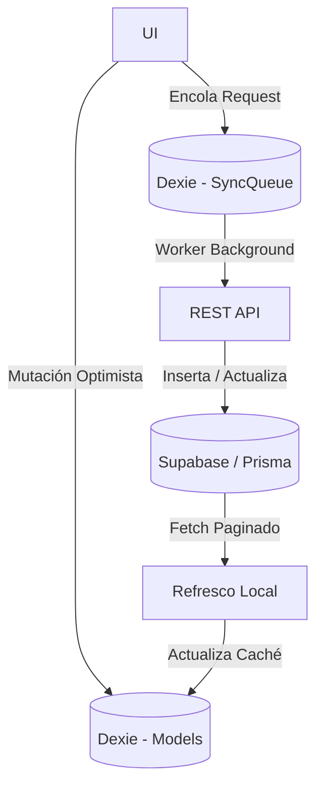
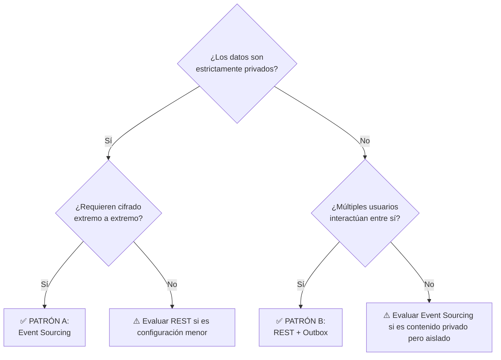

# Especificación Arquitectónica: Persistencia y Sincronización de KADOSH

Este documento define la arquitectura oficial de persistencia de datos y sincronización offline/online de KADOSH. Está diseñado para ser la referencia técnica central que guía la implementación de nuevos módulos y funcionalidades.

---

## 1. Principio Arquitectónico

KADOSH **no utiliza un único mecanismo de persistencia** para todos sus dominios. 

La plataforma adopta una filosofía de diseño pragmático guiada por el dominio (Domain-Driven Design). Cada módulo utiliza el patrón arquitectónico que mejor equilibra las siguientes cinco dimensiones:
1. **Privacidad:** ¿Los datos son confidenciales y requieren Cifrado de Extremo a Extremo (E2EE)?
2. **Consistencia:** ¿Se requiere resolución de conflictos compleja y auditoría temporal (eventual) o basta con consistencia inmediata en el servidor central?
3. **Experiencia Offline First:** Independientemente del patrón elegido, la interfaz del usuario debe reaccionar de forma instantánea sin depender de la latencia de la red.
4. **Escalabilidad:** ¿Cuál es el tamaño total del conjunto de datos compartido? ¿Es viable almacenarlo en el dispositivo local (Mobile/Web)?
5. **Simplicidad Operacional:** ¿La complejidad técnica está justificada por los beneficios aportados?

> [!IMPORTANT]
> **La elección del patrón arquitectónico depende estrictamente de la naturaleza del dominio del negocio y no de una decisión tecnológica global.**

---

## 2. Infraestructura Compartida

Independientemente del patrón de sincronización utilizado (Event Sourcing o REST), todos los módulos de KADOSH se apoyan en una base de infraestructura compartida que garantiza la homogeneidad del sistema:

*   **Dexie (IndexedDB):** Actúa como la única base de datos local visible para el Frontend. Garantiza la lectura y escritura offline.
*   **Prisma & Supabase (PostgreSQL):** Proveen la capa de persistencia central y la gestión de bases de datos relacionales en la nube.
*   **Service Worker & PWA:** Mantienen los activos estáticos disponibles offline y controlan el ciclo de vida de la red.
*   **Zustand:** Gestiona el estado reactivo global de la sesión.
*   **Sistema de Autenticación:** Provee la gestión central de sesión (JWT).
*   **OneSignal:** Canal unificado para notificaciones push.
*   **Network Monitor:** Módulo nativo que orquesta el ciclo de conexión/desconexión desencadenando los procesos de background.

La diferencia entre los patrones radica **exclusivamente en cómo los datos viajan** entre Dexie y Supabase.

---

## 3. Patrón A: Event Sourcing + CQRS (Dominios Privados)

Este patrón es el núcleo duro de KADOSH y se utiliza para garantizar máxima privacidad, trazabilidad y consistencia determinística sin un servidor autoritativo sobre la lógica del negocio.

### Cuándo Utilizarlo
Cuando el módulo maneja información financiera, patrimonial, o altamente sensible que pertenece a un círculo privado y acotado.

### Casos de Uso
- Finanzas (Transacciones, Saldos, Categorías).
- Metas de Siembra y Presupuestos.
- Espacios de Trabajo (Personal, Familiar).

### Conceptos Clave
*   **Persistencia Local:** Los comandos (`Command`) generan eventos (`WorkspaceEvent`) en Dexie. Las vistas locales (ej. `db.transactions`) se construyen reduciendo (proyectando) este historial de eventos.
*   **Fuente de Verdad:** El historial inmutable de eventos. El estado actual no existe perse, se calcula.
*   **Sincronización:** Bidireccional (`/api/sync/push` y `pull`). El `SyncEngine` transmite lotes de eventos locales y descarga eventos remotos no vistos.
*   **Transporte:** `WorkspaceEvent` fuertemente tipado.
*   **Privacidad:** Cifrado de Extremo a Extremo (E2EE). Los payloads de los eventos viajan cifrados (`encryptedPayload`); el servidor (Supabase) es ciego al contenido real.

### Ventajas
- **Privacidad Absoluta:** Cifrado militar (E2EE).
- **Trazabilidad:** Auditoría completa de cada acción que modificó el sistema (Time Travel).
- **Resolución de Conflictos Offline:** Al basarse en un historial, se evitan sobrescrituras, permitiendo convergencia perfecta de estados distribuidos.

### Limitaciones
- **Sobrecarga Computacional:** Requiere proyectar los datos localmente en cada dispositivo tras sincronizar.
- **Acoplamiento Fuerte:** Exige que el usuario sea miembro de un `Workspace` oficial con llaves criptográficas generadas.

### Flujo Completo
```mermaid
graph TD
  A[UI] -->|Despacha| B[Command]
  B -->|Genera| C[WorkspaceEvent]
  C -->|Almacena| D[(Dexie - Events)]
  D -->|SyncEngine Push| E[Supabase (Cloud)]
  E -->|SyncEngine Pull| F[Dispositivos Vinculados]
  F -->|State Reducer| G[(Dexie - Read Models)]
  G -->|useLiveQuery| H[UI Actualizada]
```

---

## 4. Patrón B: REST + Outbox Pattern (Dominios Públicos)

Este patrón se utiliza para solucionar el "Problema de la Colaboración Masiva". Abandona el cifrado E2EE y el versionado exhaustivo a cambio de una escalabilidad masiva y latencia reducida al consultar datos de terceros.

### Cuándo Utilizarlo
Cuando múltiples usuarios de toda la plataforma necesitan interactuar sobre el mismo conjunto de datos (Feed público) y el volumen total de datos impediría que cada teléfono descargara la base de datos completa.

### Casos de Uso
- Comunidad de Oraciones (Peticiones públicas, contadores de interacción).
- Futuro: Foros, Chat Global, Perfiles Públicos, Leaderboards.

### Conceptos Clave
*   **Persistencia Local (Optimistic UI):** La acción actualiza instantáneamente el modelo en Dexie (ej. `db.prayerRequests`).
*   **Sincronización (Outbox):** Se inserta un Job (tarea) en `db.syncQueue` (la "Bandeja de Salida"). Un worker asíncrono toma la tarea y ejecuta una llamada REST tradicional al backend.
*   **Fuente de Verdad:** La base de datos central de Prisma (PostgreSQL).
*   **Transporte:** API REST estandarizada (POST, PATCH, DELETE).

### Ventajas
- **Escalabilidad de Cliente:** El dispositivo solo pide al servidor los datos que necesita (paginados o filtrados por scope), protegiendo la memoria de Dexie.
- **Rendimiento Servidor:** Permite delegar conteos globales y agregaciones nativas (ej. `JOIN`, `COUNT`) a la base de datos SQL.
- **Simplicidad:** Arquitectura CRUD estándar en el backend.

### Limitaciones
- **Sin Historial Extensivo:** Al sobreescribir el registro en SQL (Update), se pierde el historial intermedio si no se crean tablas log específicas.
- **Datos Visibles:** El servidor puede leer los datos (No-E2EE).

### Restricciones
- **Idempotencia Obligatoria:** Dado que el cliente puede enviar un request REST múltiples veces debido a cortes de red repentinos, los controladores de la API deben diseñarse de forma idempotente usando el **UUID generado por el cliente**. El servidor debe procesar silenciosamente los duplicados devolviendo un código de éxito para purgar la cola del cliente.

### Flujo Completo


---

## 5. Cuadro Comparativo

| Aspecto | Event Sourcing + CQRS | REST + Outbox (SyncQueue) |
| :--- | :--- | :--- |
| **Ámbito** | Datos Privados / Workspaces | Datos Públicos / Comunidad |
| **Offline First** | Sí (Mecanismo nativo Eventual) | Sí (Mecanismo de Cola/Outbox) |
| **Cifrado E2EE** | **Sí (Requerido)** | No (Datos públicos en BD) |
| **Fuente de Verdad** | Event Store (Historial) | PostgreSQL (Estado Actual) |
| **Consistencia** | Eventual Fuerte (Time Travel) | Inmediata en DB / Eventual en Cliente |
| **Escalabilidad Cliente** | Limitada (Pesa por cada evento propio) | **Excelente** (Solo descarga lo que ve) |
| **Complejidad** | Muy Alta | Media |
| **Colaboración Masiva** | Inviable (Split-Brain / Bloqueo por E2EE) | Diseñado para ello |

---

## 6. Guía de Decisión Arquitectónica

Utiliza el siguiente árbol de decisión antes de desarrollar cualquier módulo nuevo en KADOSH.



> [!CAUTION]
> **REGLA ARQUITECTÓNICA OBLIGATORIA:**
> Un mismo Aggregate o Bounded Context **nunca debe utilizar simultáneamente Event Sourcing y REST + Outbox** como mecanismos principales de sincronización de su estado.
> 
> *Contexto histórico:* Mezclar ambos patrones dentro del mismo dominio fue precisamente la causa del grave problema de "Split-Brain" detectado durante el desarrollo inicial del módulo de Oraciones (el frontend generaba un UUID para Event Sourcing y Prisma generaba otro diferente para REST, rompiendo irreversiblemente el flujo).

---

## 7. Manejo de Perfiles Públicos (Fallback Público)

En los módulos comunitarios (REST), el backend necesita mostrar la identidad del creador de una acción. Sin embargo, no siempre está disponible su nombre completo al momento de registrar el evento (ej. un usuario sin internet que recibe interacción).

KADOSH utiliza un sistema escalonado de degradación de identidad. El sistema evaluará el nombre a mostrar en el siguiente orden estricto:

1. **Nombre + Inicial del Apellido:** (ej. `"Gianluca B."`). *Óptimo.*
2. **Nombre Únicamente:** (ej. `"Gianluca"`).
3. **Alias Público:** Configurado por el usuario (si aplica a futuro).
4. **"Usuario":** Último recurso.

> [!WARNING]
> Llegar al último nivel (`"Usuario"`) indica una falla en la captura temprana de datos de onboarding. El frontend registrará obligatoriamente un `console.warn` alertando de un comportamiento de fallback extremo (`Public name fallback to 'Usuario' used for userId`).

---

## 8. Patrones Futuros Documentados (En Exploración)

Para garantizar que la arquitectura pueda evolucionar, queda documentada la posibilidad de introducir un tercer patrón en el futuro exclusivamente para contextos de **Tiempo Real de muy baja persistencia**.

### Tiempo Real (Event-Driven Efímero)
*   **Aplicaciones potenciales:** Chat Global, Presencia (indicadores de "En línea"), Colaboración en vivo de pizarras, Indicadores de "Escribiendo...".
*   **Tecnologías contempladas:** WebSockets, Supabase Realtime Channels, Broadcast Channels.
*   **Filosofía:** Datos que no necesitan sobrevivir indefinidamente en IndexedDB ni ser procesados offline.

*(Nota: Este patrón aún no forma parte de la arquitectura oficial de la versión actual).*
